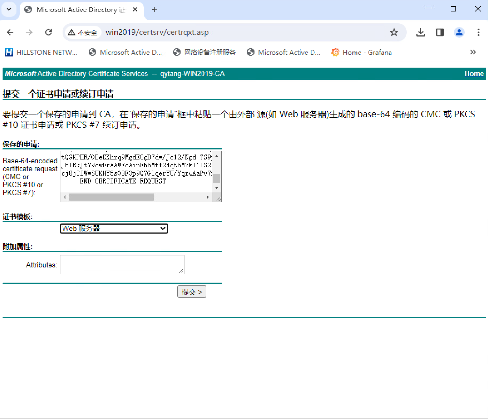

### 加载根证书
```shell
asa(config)# crypto ca authenticate CA
Enter the base 64 encoded CA certificate.
End with the word "quit" on a line by itself
-----BEGIN CERTIFICATE-----
MIIDbTCCAlWgAwIBAgIQPux2+5XejqpPi6YpZKh9mDANBgkqhkiG9w0BAQsFADBJ
MRMwEQYKCZImiZPyLGQBGRYDY29tMRYwFAYKCZImiZPyLGQBGRYGcXl0YW5nMRow
GAYDVQQDExFxeXRhbmctV0lOMjAxOS1DQTAeFw0yMzEwMzAwNzQ5MDVaFw0yODEw
MzAwNzU5MDRaMEkxEzARBgoJkiaJk/IsZAEZFgNjb20xFjAUBgoJkiaJk/IsZAEZ
FgZxeXRhbmcxGjAYBgNVBAMTEXF5dGFuZy1XSU4yMDE5LUNBMIIBIjANBgkqhkiG
9w0BAQEFAAOCAQ8AMIIBCgKCAQEAqZl6EUXQnjJi05Q8pSyotgdT8t+PkHS0rB7h
jDpG0jRzWmHK+JUB7tjgDDi4sZJmFrJZguqgRg8oDaxi0mLgfnbRuyiEmyQ3qT5o
OsS53NUwzzwMaZt3Xa3QbWz1esVYoXaBrxj4jzVJnLfj/ipqm2IDUp2c4t5/dJ6p
dm2wozLDvfkh0WVAIsou6idhD70xs0qFlJXpzr9+bMIgmku7CXY4t0znxbcGj7k4
Flo0QNK/ntBNJvf9d2apYwwBKVW67fXLwdspNX6QSFvXrD+RpIbrCwzDbwTRMi6l
8uJQvhaR2Iz3ofhc0T3Iz82VYnWkhTEpdgpEJs/Re126HlKdgQIDAQABo1EwTzAL
BgNVHQ8EBAMCAYYwDwYDVR0TAQH/BAUwAwEB/zAdBgNVHQ4EFgQUUFL70NIGv4uo
SdsmnSXzP5nYHIAwEAYJKwYBBAGCNxUBBAMCAQAwDQYJKoZIhvcNAQELBQADggEB
ADJkbCedFrbzODUSES3PPPC0lDuZSF7CfZtsVmmM/mJ932uvw5DvlFw5qxB3EMbk
jyY32YZs6Njxcr36QZUnyQHRjx2JlC6Kbi5k2SgihOcvB9HhDOP8AKLe442FBotA
Mraq3smNE8V9tnT9ouPYhkOz1C/vhxd22yphfDcYDSrutNivPkdP+G2+lgLlr8oh
50tUMLWsZ996pccGQrdo9uomLUROQ8d+a/vul3K31fEe9Prb1U5JLJjP51WqxGfH
UdfOG390ZJs0HGiKACznp6ccKLulntBv1UESToEyIPIUxQlMquSVZcNqi7OyCc+G
vop+0ldAf+lonSgSAdwqiQA=
-----END CERTIFICATE-----

quit

INFO: Certificate has the following attributes:
Fingerprint:     ae7b21b0 3019a3f3 363d140a e322b988
Do you accept this certificate? [yes/no]: yes

Trustpoint CA certificate accepted.

% Certificate successfully imported

```

### 产生证书请求
```shell
asa(config)# crypto ca enroll CA
% Start certificate enrollment ..
% The subject name in the certificate will be: cn=asa.qytang.com,ou=qytang,o=qytbj

% The fully-qualified domain name in the certificate will be: asa.qytang.com

% Include the device serial number in the subject name? [yes/no]: no

% The IP address in the certificate is 202.100.3.10

Display Certificate Request to terminal? [yes/no]: yes
Certificate Request follows:
-----BEGIN CERTIFICATE REQUEST-----
MIIC9TCCAd0CAQAwdDEOMAwGA1UEChMFcXl0YmoxDzANBgNVBAsTBnF5dGFuZzEX
MBUGA1UEAxMOYXNhLnF5dGFuZy5jb20xODAZBgkqhkiG9w0BCQgTDDIwMi4xMDAu
My4xMDAbBgkqhkiG9w0BCQIWDmFzYS5xeXRhbmcuY29tMIIBIjANBgkqhkiG9w0B
AQEFAAOCAQ8AMIIBCgKCAQEAjh5GF6IaEdlsajArC6q9ESMV9AbKpjvv1ZWvqYhq
5LEtbv0QWw59DVYsewciLb9hMM1iB+/OS9w+dnAJtr73UP6q6KWHbLaI/gOO1Dic
tVpp/jaek/hGnxJgzbczEsnzEq/klcNSwsqH8L3BA3NE9qG7NeL2YxojJeyGmaKi
NjSjrjSxCrYaOZ+DZFFmhcyaVobmZfqkVYMV4UGVr7l3OWNo12bkijoFbH2q/NtD
fMxUIQdBpySEpUv7yh22FZbCzJM51j203BQ7TcUbgX0kU6XvW4Gart7Jg0UasW9P
Z94CZIdADnAVX5Bmfdhf+H51LURNMUA06c1jguXX+K7QjwIDAQABoDwwOgYJKoZI
hvcNAQkOMS0wKzAOBgNVHQ8BAf8EBAMCBaAwGQYDVR0RBBIwEIIOYXNhLnF5dGFu
Zy5jb20wDQYJKoZIhvcNAQEFBQADggEBAAwNQ05fhnwcTXXuzMJHKx7k8Sf7YMhP
YXc+hQfyl9TPMja0inay+ylVXlVsBnUjIXwAfKjqUkEycz6mAgwm9ktu63Nh1hQ6
95q4f5U+DyaZJe/whRN33wmf2RaZMwxnC5ktPDuq5jtXIQoCx/bFqGOM7n4FnReS
tQGKPHR/OBeEKhrq9MgdECgB7dw/Jo12/Ngd+TS9yEbmD5RUJB5U1Ajdxj2VMG0g
JbIRkJtY9dwDrAAWFdAinFbhMf+24qthM7kI1lS280cNIGIUZUBu1hOVCHS+a2QV
cj8jTIWwSUKHY5sO3FOp9Q7GlqerYU/Yqr4AaPv7n7luTJiZTuda1Dw=
-----END CERTIFICATE REQUEST-----

Redisplay enrollment request? [yes/no]: no

```

### 在微软证书服务器申请证书(证书模板: Web服务器)


### 导入申请的证书
```shell
asa(config)# crypto ca import CA certificate

% The fully-qualified domain name in the certificate will be: asa.qytang.com

% The IP address in the certificate is 202.100.3.10


Enter the base 64 encoded certificate.
End with the word "quit" on a line by itself

-----BEGIN CERTIFICATE-----
MIIFizCCBHOgAwIBAgITEQAAABRsoojvfFGOOgAAAAAAFDANBgkqhkiG9w0BAQsF
ADBJMRMwEQYKCZImiZPyLGQBGRYDY29tMRYwFAYKCZImiZPyLGQBGRYGcXl0YW5n
MRowGAYDVQQDExFxeXRhbmctV0lOMjAxOS1DQTAeFw0yMzExMDEwMTIwNDNaFw0y
NTEwMzEwMTIwNDNaMHYxGzAZBgkqhkiG9w0BCQgTDDIwMi4xMDAuMy4xMDEdMBsG
CSqGSIb3DQEJAhMOYXNhLnF5dGFuZy5jb20xDjAMBgNVBAoTBXF5dGJqMQ8wDQYD
VQQLEwZxeXRhbmcxFzAVBgNVBAMTDmFzYS5xeXRhbmcuY29tMIIBIjANBgkqhkiG
9w0BAQEFAAOCAQ8AMIIBCgKCAQEAjh5GF6IaEdlsajArC6q9ESMV9AbKpjvv1ZWv
qYhq5LEtbv0QWw59DVYsewciLb9hMM1iB+/OS9w+dnAJtr73UP6q6KWHbLaI/gOO
1DictVpp/jaek/hGnxJgzbczEsnzEq/klcNSwsqH8L3BA3NE9qG7NeL2YxojJeyG
maKiNjSjrjSxCrYaOZ+DZFFmhcyaVobmZfqkVYMV4UGVr7l3OWNo12bkijoFbH2q
/NtDfMxUIQdBpySEpUv7yh22FZbCzJM51j203BQ7TcUbgX0kU6XvW4Gart7Jg0Ua
sW9PZ94CZIdADnAVX5Bmfdhf+H51LURNMUA06c1jguXX+K7QjwIDAQABo4ICPTCC
AjkwDgYDVR0PAQH/BAQDAgWgMBkGA1UdEQQSMBCCDmFzYS5xeXRhbmcuY29tMB0G
A1UdDgQWBBSBDmzB1i+9mjKsDQTQMyAk4QxsqTAfBgNVHSMEGDAWgBRQUvvQ0ga/
i6hJ2yadJfM/mdgcgDCBzgYDVR0fBIHGMIHDMIHAoIG9oIG6hoG3bGRhcDovLy9D
Tj1xeXRhbmctV0lOMjAxOS1DQSxDTj1XSU4yMDE5LENOPUNEUCxDTj1QdWJsaWMl
MjBLZXklMjBTZXJ2aWNlcyxDTj1TZXJ2aWNlcyxDTj1Db25maWd1cmF0aW9uLERD
PXF5dGFuZyxEQz1jb20/Y2VydGlmaWNhdGVSZXZvY2F0aW9uTGlzdD9iYXNlP29i
amVjdENsYXNzPWNSTERpc3RyaWJ1dGlvblBvaW50MIHCBggrBgEFBQcBAQSBtTCB
sjCBrwYIKwYBBQUHMAKGgaJsZGFwOi8vL0NOPXF5dGFuZy1XSU4yMDE5LUNBLENO
PUFJQSxDTj1QdWJsaWMlMjBLZXklMjBTZXJ2aWNlcyxDTj1TZXJ2aWNlcyxDTj1D
b25maWd1cmF0aW9uLERDPXF5dGFuZyxEQz1jb20/Y0FDZXJ0aWZpY2F0ZT9iYXNl
P29iamVjdENsYXNzPWNlcnRpZmljYXRpb25BdXRob3JpdHkwIQYJKwYBBAGCNxQC
BBQeEgBXAGUAYgBTAGUAcgB2AGUAcjATBgNVHSUEDDAKBggrBgEFBQcDATANBgkq
hkiG9w0BAQsFAAOCAQEAgOZz8OXSx4473a68Ttq5EbwC3ZyIQmlNRbkNwJpUmRRT
D8s9Y9zk9ajm6pV3ObZ0zkz5a3HVzrm5BXEHNA2R+mi9wNcbEIME199J5uiNuEck
N9HEUtE530prg48YtmNOyWQE7xXe9BJFqvqixI4bYei3N3ovOGdMQ7GUpTMTrmg0
oriXyqbPKDm7l+R6yk8scDfpczKQOeyeX2Zw8ZacJC+Cmxn4wZNCpnQQc9+k6BRg
Ydlq2S4FU2USjU31yAgDw+MH0TFR6b06dz3cGnQ5D0daLs/rj6M7dAfCVwPucc3/
4YK+O/DC/GOZGQhkqFahehaKAhWLPQWANpsWlOInow==
-----END CERTIFICATE-----

quit
INFO: Certificate successfully imported

```

### 查看最终的证书状态
```shell
asa# show crypto ca certificates CA
Certificate
  Status: Available
  Certificate Serial Number: 11000000146ca288ef7c518e3a000000000014
  Certificate Usage: General Purpose
  Public Key Type: RSA (2048 bits)
  Signature Algorithm: SHA256 with RSA Encryption
  Issuer Name:
    cn=qytang-WIN2019-CA
    dc=qytang
    dc=com
  Subject Name:
    cn=asa.qytang.com
    ou=qytang
    o=qytbj
    hostname=asa.qytang.com
    ipaddress=202.100.3.10
  CRL Distribution Points:
    [1]  ldap:///CN=qytang-WIN2019-CA,CN=WIN2019,CN=CDP,CN=Public%20Key%20Services,CN=Services,CN=Configuration,DC=qytang,DC=com?certificateRevocationList?base?objectClass=cRLDistributionPoint
  Validity Date:
    start date: 09:20:43 GMT Nov 1 2023
    end   date: 09:20:43 GMT Oct 31 2025
  Associated Trustpoints: CA

CA Certificate
  Status: Available
  Certificate Serial Number: 3eec76fb95de8eaa4f8ba62964a87d98
  Certificate Usage: Signature
  Public Key Type: RSA (2048 bits)
  Signature Algorithm: SHA256 with RSA Encryption
  Issuer Name:
    cn=qytang-WIN2019-CA
    dc=qytang
    dc=com
  Subject Name:
    cn=qytang-WIN2019-CA
    dc=qytang
    dc=com
  Validity Date:
    start date: 15:49:05 GMT Oct 30 2023
    end   date: 15:59:04 GMT Oct 30 2028
  Associated Trustpoints: CA

```